# Testesterone

**Strengthen your clientside applications with in-browser tests**

* Output is printed to the console
* Handle async tests
* No need to mock `window` and browser APIs
* Minimal `expect`-style assertions built-in

## Installation

```bash
npm install testesterone -D
```

## Example

_`index.html`_
```html
<h1>Hello!</h1>
<input type="text" placeholder="Your name" id="nameInput">
```

_`app.js`_
```js
var h1 = document.querySelector('h1');
var nameInput = document.getElementById('nameInput');

nameInput.oninput = function() {
  h1.textContent = 'Hello ' + nameInput.value;
};
```

_`app.test.js`_
``` js
var test = require('testesterone');

var h1 = document.querySelector('h1');
var nameInput = document.getElementById('nameInput');

test('Hello world', function(it) {

  it('is initialized to "Hello"', function(expect) {
    expect(h1.textContent).to.equal('Hello!');
  });

  it('updates text to input\'s value', function(expect) {
    nameInput.value = 'world';
    nameInput.oninput();
    expect(h1.textContent).to.equal('Hello world');
  });

  it('saves result in localstorage'); // not yet implemented!

})();
```

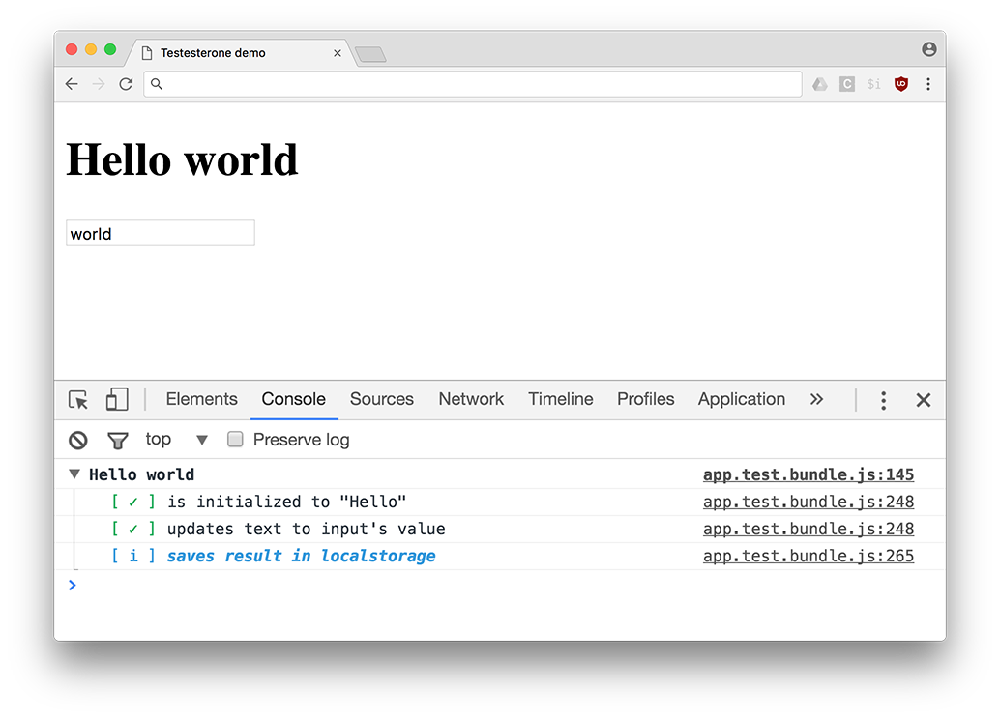

## Overview

Testesterone was built to make it simple to test clientside code within a browser. This means there is no need for headless browsers, or for simulating a browser environment from within node.js.

In addition, all test results appear in the console, not in any sort of ui. This allows you to run assertions against the actual contents of the DOM within your tests.

### API

##### `test(label, callback)`

The `test` function creates a group in the console that contains your assertions.

```js
test('foo', function() {
  // ...
})();
```

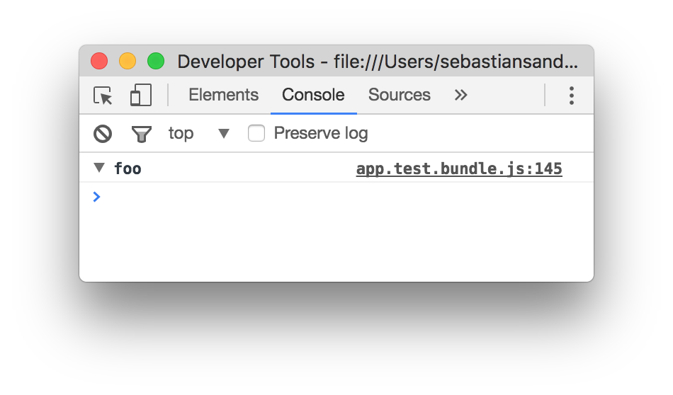

`test`s can also be nested, which allows for grouping. For example:

```js
test('Array', function() {
  test('indexOf', function() {});
  test('join', function() {});
  test('push', function() {});
  test('slice', function() {});
})();
```

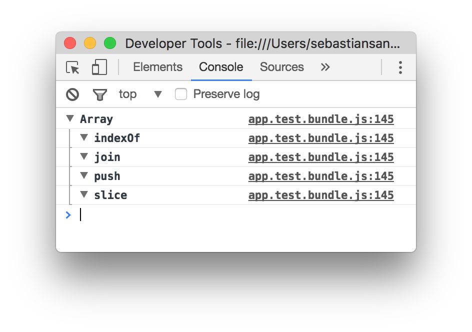

_(Note that the outermost `test()`'s return value is a function that must be called! Without doing this, your tests will not be run. ie. You should do this: `test(label, callback)()`)_

Of course, this is not very useful without assertions to run.

#### `it(label, callback)`

Assertions are run within the context of an `it` function that helps label the functionality of what it is that these assertions test.

```js
test('foo', function(it) {
  it('runs a test');
})();
```

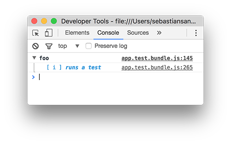

When `it` is called, the first argument must be a string that serves as the label for that test. If only that label is passed to `it`, then the test serves only as an informational label. This can be a placeholder for some future test that needs to be written, or for some functionality that has yet to be implemented. To run a test, you must pass a second argument to `it` which is a callback function that takes a parameter. This parameter is what will create each assertion.

```js
test('foo', function(it) {
  it('runs a test', function(expect) {
    expect(123).to.equal(456);
  });
})();
```

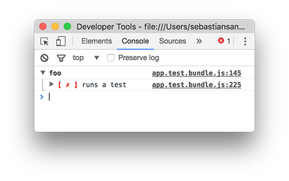

This test obviously fails. We can expand the failing test to see the reason for the failure. And in fact, this can be further expanded to reveal the full stack trace if desired.

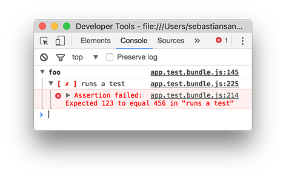

Now let's make the test pass:

```js
test('foo', function(it) {
  it('runs a test', function(expect) {
    expect(123).to.equal(123);
  });
})();
```

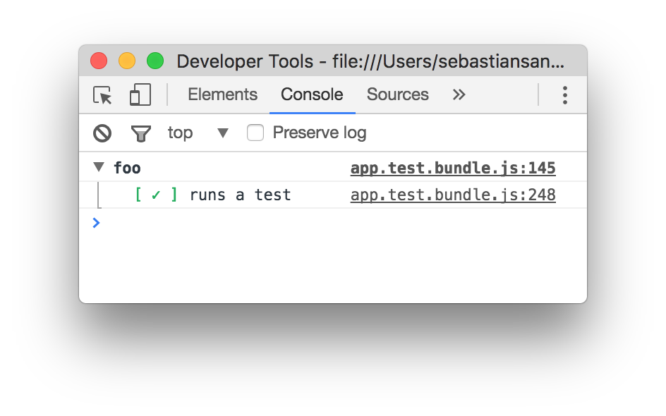

Or for a more complete example:

```js
test('Array', function(it) {

  test('indexOf', function() {
    it('returns the index of an element in the array', function(expect) {
      expect([1, 2, 3].indexOf(3)).to.equal(2);
    });
  });

  test('join', function() {
    it('joins an array into a string', function(expect) {
      expect([1, 2, 3].join(':')).to.equal('1:2:3');
    });
    it('joins with a comma by default', function(expect) {
      expect([1, 2, 3].join()).to.equal('1,2,3');
    });
  });

  test('push', function() {
    it('appends an item to an array', function(expect) {
      var x = [1, 2, 3];
      x.push(4);
      expect(x).to.equal([1, 2, 3, 4]);
    });
  });

})();
```

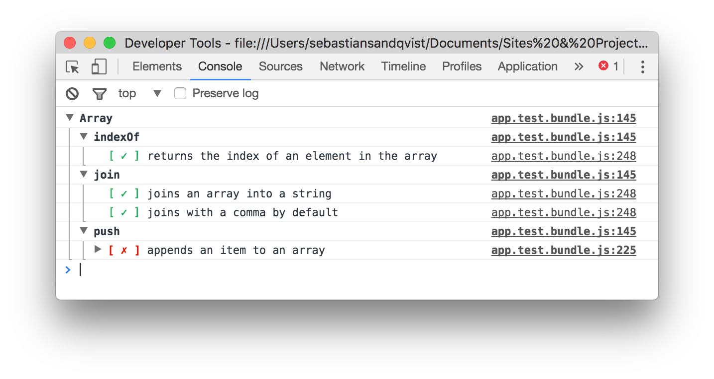

All the tests pass, but one. The last test fails because `x` is not strictly equal to the new array `[1, 2, 3, 4]` although they are structurally the same. The `expect` function comes with a built-in deep equality detector for such situations. Changing `expect(x).to.equal([1, 2, 3, 4]);` to `expect(x).to.deep.equal([1, 2, 3, 4]);` will solve this problem.

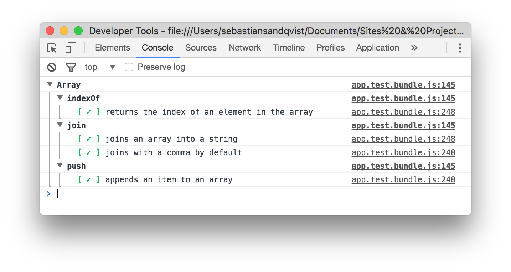

#### `expect()`

Expect has a very minimal assertion API. It has the following methods:

* `expect(x).equal(y)`: asserts that `x === y`
* `expect(x).not.equal(y)`: asserts that `x !== y`
* `expect(x).deep.equal(y)`: asserts that `deepEquals(x, y)`
* `expect(x).not.deep.equal(y)`: asserts that `!(deepEquals(x, y))`
* `expect(x).explode()`: asserts that `x()` throws an error
* `expect(x).not.explode()`: asserts that `x()` does not throw

All of the methods can be prefixed with `to` so that they read like spoken english. For example:

```js
expect(x).to.equal(y);
```

Unlike assertion libraries like Chai, which include many methods that allow code like the following to be written: `expect('foo bar').to.include('bar');`, this library opts instead for a minimal api so that you do not have to check the documentation to know what is and is not supported by the assertion library. Anything that could be tested with those helper methods can be tested using the `to.equal()` interface. For instance, the previous example could be written as: `expect('foo bar'.includes('bar')).to.equal(true);`.

## Async support

Async functions can be easily tested with testesterone. As a bonus, their executions will be timed. In order to test any asynchronous code, pass a second parameter to the `it()` function. That second parameter will be a callback that should be called when the asynchronous code is finished executing.

```js
test('foo', function(it) {
  it('runs a test after 1 second', function(expect, done) {
    setTimeout(function() {
      expect('foo').to.equal('foo');
      done();
    }, 1000);
  });
})();
```

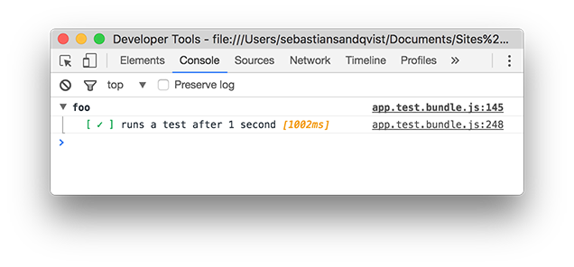

All tests, including asynchronous tests, will be run sequentially.

This works with promises as well. The equivalent promise to the above function would be:

```js
test('foo', function(it) {
  it('runs a test after 1 second', function(expect, done) {
    new Promise(function(resolve) {
      setTimeout(function() {
        expect('foo').to.equal('foo');
        resolve();
      }, 1000);
    }).then(done);
  });
})();
```

The default maximum timeout on an asynchronous function before it is forced to fail is 2 seconds. This can be configured by setting `test.timeout` prior to running a test.

For example:

```js
test.timeout = 9000; // set the max time a single test can run to 9 seconds

test('foo', function(it) {
  it('tests a long-running function', function(expect, done) {
    setTimeout(function() {
      expect('foo').to.equal('foo');
      done();
    }, 4000);
  });
})();
```

And it should be noted that tests do not have to be asynchronous in order for the `done` callback to be useful. For heavy functions that may take a while to compute, the timer provided by calling `done()` may be nice to have. It relies internally on `performance.now()`.

```js
test('heavy function', function() {
  it('takes a while to compute', function(expect, done) {
    var numbers = [];
    for (var i = 0; i < 123456789; i++) {
      numbers.push(i);
    }
    done();
  });
});
```

## Shorthand

Assertions can be written in a more terse syntax if desired:

```js
test('foo', function(it) {
  it('does something', (t) => t('foo').not.equal('bar')); // test passes
  it('does something else', (t) => t('foo').equal('bar')); // test fails
});
```

## Theme support

Testesterone also works with the dark theme in Chrome's developer console:

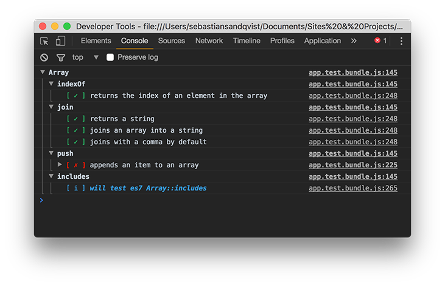

## Caveats

1. Other browsers are not officially supported at this time. Many do not have the same degree of support for the `console` methods as Chrome, and this library makes use of many.
2. Tests must be run within a browser context. This wasn't intended to be used in node.js.
3. The `expect` interface relies internally on `console.assert` and does not throw an error if an assertion fails. For this reason, external assertion libraries like Chai would be difficult to integrate.